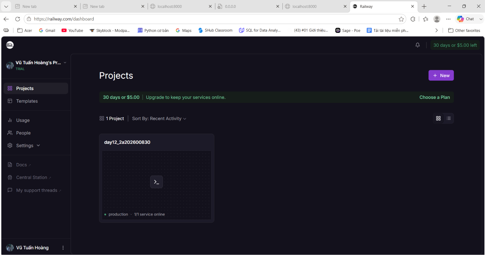

#  Delivery Checklist — Day 12 Lab Submission

> **Student Name:** Vũ Tuấn Hoàng
> **Student ID:** 2A202600830  
> **Date:** 12/06/2026  

---
# Day 12 Lab - Mission Answers

## Part 1: Localhost vs Production

### Exercise 1.1: Anti-patterns found
1. API key hardcode trong code.
2. Không có config management (biến môi trường).
3. Sử dụng `print()` thay vì proper logging chuẩn (JSON format).
4. Không có health check endpoint.
5. Port cố định (hardcode) không đọc từ environment.

### Exercise 1.3: Comparison table
| Feature | Develop | Production | Why Important? |
|---------|---------|------------|----------------|
| Config  | Hardcode trong code | Dùng Environment Variables | Tránh lộ API key lên Github, dễ dàng thay đổi cấu hình trên server mà không cần sửa code. |
| Health check | Không có | Có endpoint `/health` và `/ready` | Để các nền tảng (Platform) biết khi nào server bị treo hoặc sẵn sàng nhận traffic để restart/route request. |
| Logging | Dùng `print()` | Dùng Structured JSON logging | Dễ dàng cho các hệ thống như Datadog/Kibana đọc và phân tích log tự động. |
| Shutdown | Tắt đột ngột (Hard kill) | Graceful Shutdown | Đợi xử lý xong các request đang xử lý dở rồi mới tắt hẳn, giúp không bị mất data của người dùng. |

## Part 2: Docker

### Exercise 2.1: Dockerfile questions
1. Base image: `python:3.11`
2. Working directory: `/app`
3. Tại sao COPY requirements.txt trước? Để tận dụng Docker layer cache. Docker sẽ không cài lại thư viện nếu `requirements.txt` không thay đổi, giúp tiết kiệm thời gian build.
4. CMD vs ENTRYPOINT khác nhau thế nào? `CMD` cung cấp lệnh mặc định để thực thi (dễ bị ghi đè), trong khi `ENTRYPOINT` quy định executable chính của container (khó ghi đè hơn).

### Exercise 2.3: Image size comparison
- Develop: ~1 GB (Base image python:3.11 full)
- Production: ~150-200 MB (Multi-stage build dùng python-slim)
- Difference: Rất lớn, giúp giảm dung lượng lưu trữ và thời gian deploy.

## Part 3: Cloud Deployment

### Exercise 3.1: Railway deployment
- URL: https://day122a202600830-production.up.railway.app
- Screenshot: 

## Part 4: API Security

### Exercise 4.1 - 4.3: Test results
```bash
# 4.1 & 4.2 API Test (với API Key / Token)
$ curl -X POST https://day122a202600830-production.up.railway.app/ask \
  -H "X-API-Key: my-secret-key" \
  -H "Content-Type: application/json" \
  -d '{"question": "Explain microservices"}'
  
{"answer":"Agent đang hoạt động tốt! (mock response) Hỏi thêm câu hỏi đi nhé."}

# 4.3 Rate Limiting Test (Gọi liên tục vượt quá 10 req/min)
$ curl -X POST ...
{"detail":{"error":"Rate limit exceeded","limit":10,"window_seconds":60,"retry_after_seconds":14}}
```

### Exercise 4.1: API Key authentication (Explanations)
1. **API key được check ở đâu?** Được check ở hàm `verify_api_key` trong file `app.py` thông qua class `APIKeyHeader` (lấy từ Header `X-API-Key`). Hàm này được tiêm vào các endpoint thông qua `Depends(verify_api_key)`.
2. **Điều gì xảy ra nếu sai key?** Hệ thống sẽ bắn ra lỗi `HTTPException(403)` với thông báo "Invalid API key". (Nếu thiếu key thì báo lỗi `401`).
3. **Làm sao rotate key?** Chỉ cần thay đổi biến môi trường `AGENT_API_KEY` ở Server/Cloud, sau đó khởi động lại server.
### Exercise 4.2: JWT authentication (Advanced)
- Khác với API Key (tĩnh), JWT sử dụng luồng login: gửi `username` + `password` tới `/token` để lấy chuỗi JWT Token có thời hạn.
- Sau đó dùng token đó nhét vào Header `Authorization: Bearer <token>` để gọi API.
### Exercise 4.3: Rate limiting
1. **Algorithm nào được dùng?** Thuật toán `Sliding Window Counter`.
2. **Limit là bao nhiêu requests/minute?** User bình thường là 10 requests / 60 giây. Admin là 100 requests / 60 giây.
3. **Làm sao bypass limit cho admin?** Phân quyền user, nếu là admin thì gán vào instance `rate_limiter_admin` thay vì `rate_limiter_user`.
### Exercise 4.4: Cost guard implementation
**Cách tiếp cận (Approach):**
Sử dụng Redis để theo dõi chi phí theo dạng `<Năm-Tháng>` (ví dụ `budget:user_id:2026-06`).
Mỗi lần gọi API:
1. Đọc chi phí hiện tại từ Redis.
2. Cộng thêm `estimated_cost` (ước tính chi phí cho câu hỏi chuẩn bị hỏi).
3. Nếu tổng chi phí > $10 (budget cho phép) thì Return `False` (từ chối request).
4. Nếu hợp lệ, lưu ngược lại vào Redis với hàm `incrbyfloat` và xét thời gian hết hạn (`expire`) là cuối tháng để reset budget.

## Part 5: Scaling & Reliability

### Exercise 5.1: Health checks
- Implement 2 endpoints:
  - `/health` (Liveness probe): Dùng để báo cáo tiến trình (container) vẫn đang chạy, thường chỉ return `{"status": "ok"}`.
  - `/ready` (Readiness probe): Dùng để kiểm tra các service phụ thuộc (như Redis, Database) đã kết nối thành công chưa. Nếu chưa sẽ trả về mã lỗi `503 Service Unavailable`.

### Exercise 5.2: Graceful shutdown
- Bắt tín hiệu ngắt (SIGTERM/SIGINT) bằng thư viện `signal` của Python.
- Khi nhận tín hiệu, hệ thống sẽ ngừng nhận request mới, đợi các request đang chạy xử lý xong, đóng các kết nối tới Database/Redis một cách an toàn rồi mới `exit()`.

### Exercise 5.3: Stateless design
- **Stateful (Sai lầm):** Lưu trạng thái (ví dụ như lịch sử chat) vào biến toàn cục trên memory của 1 instance. Khi scale lên nhiều instance, user bị mất kết nối hoặc gọi trúng instance khác sẽ bị mất lịch sử.
- **Stateless (Chuẩn):** Không lưu trạng thái trên memory mà đưa toàn bộ dữ liệu (như lịch sử chat, budget) ra ngoài (ví dụ lưu trên Redis). Nhờ vậy, mọi instance đều có thể đọc/ghi từ Redis, đảm bảo tính nhất quán.

### Exercise 5.4 & 5.5: Load balancing & Test stateless
- Khi chạy lệnh `docker compose up --scale agent=3`, Docker sẽ sinh ra 3 container Agent.
- Nginx sẽ đóng vai trò **Load Balancer**, phân chia đều lượng traffic vào cả 3 agent này.
- Khi một Agent bị ngắt đột ngột (hoặc khi scale down), nhờ thiết kế Stateless (lưu trên Redis), toàn bộ dữ liệu người dùng vẫn được bảo toàn và các request tiếp theo được Nginx đẩy sang các Agent khác mà người dùng không hề hay biết sự gián đoạn.

**Test results:**
```bash
# Kiểm tra Health Check của hệ thống Scale
$ curl https://day122a202600830-production.up.railway.app/health
{"status":"ok","uptime_seconds":176.4,"version":"2.0.0"}
```
